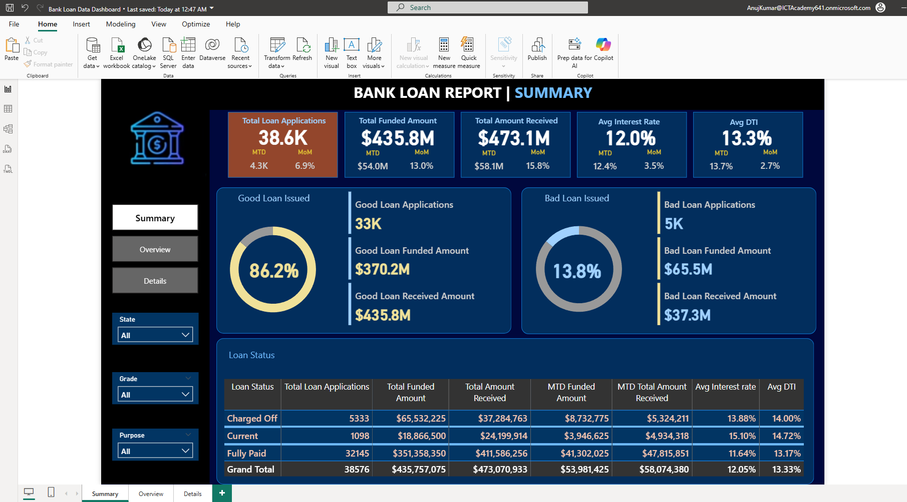
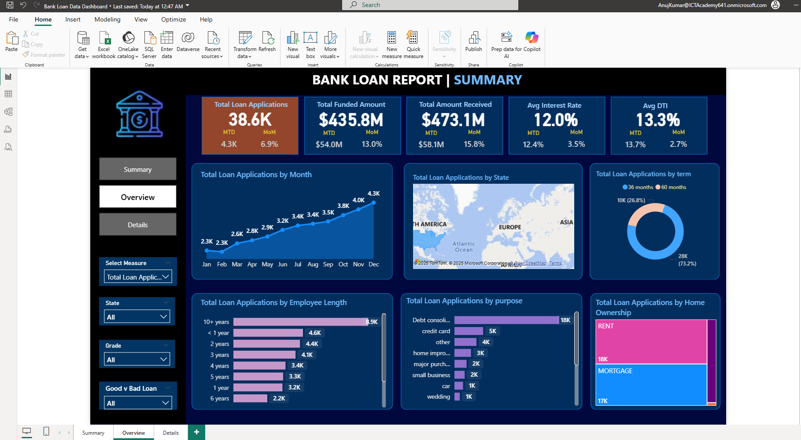
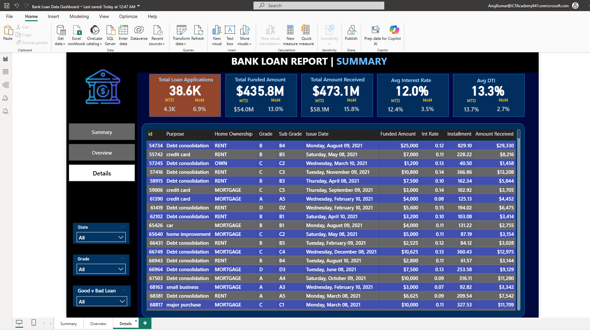

# Bank Loan Analytics — SQL + Power BI 📊

A complete **Data Analytics portfolio project** analyzing ~38k+ bank loans using **MS SQL Server** and **Power BI**.  
The project demonstrates the end-to-end data workflow: importing raw data → writing SQL queries → building interactive dashboards → generating business insights.  

---

## 🔧 Tech Stack
- **SQL (MS SQL Server)** – queries, KPIs, aggregations  
- **Power BI** – data modeling, DAX, interactive dashboards  
- **Excel** – cleaning, verification, cross-checking outputs  
- **GitHub** – version control, portfolio hosting  

---

## 📂 Repository Structure
sql/ -- SQL scripts (KPI queries, good vs bad loans, trend analysis)
powerbi/ -- Power BI report (.pbix)
ppt/ -- Project presentation deck
images/ -- Dashboard screenshots (2.png, 3.png, 4.png)
data/README.md -- Dataset source and notes
README.md -- Project overview (this file)

---

## 🧮 Business KPIs
- **Total Loan Applications** (+ Month-to-Date, MoM changes)  
- **Total Funded Amount** (+ Month-to-Date, MoM changes)  
- **Total Amount Received** (+ Month-to-Date, MoM changes)  
- **Average Interest Rate** (overall, MTD, MoM trend)  
- **Average Debt-to-Income Ratio (DTI)**  

### Good vs Bad Loans
- % of Good Loan Applications vs Bad Loan Applications  
- Funded Amount (Good vs Bad)  
- Received Amount (Good vs Bad)  

---

## 📊 Dashboards

### **1. Summary Dashboard**
Key KPIs, Good vs Bad loan split, Loan Status grid.  

---

### **2. Overview Dashboard**
Trends & segment analysis:  
- Monthly lending activity (line chart)  
- Regional lending by state (map)  
- Loan term distribution (donut chart)  
- Employment length impact (bar chart)  
- Loan purpose breakdown (bar chart)  
- Home ownership analysis (tree map)  

---

### **3. Details Dashboard**
Record-level data view for slicing and drill-down analysis.  

---

## 🗃️ SQL Queries
All SQL queries used in this project are available here:  
📂 [SQLQuery111111.sql](SQLQuery111111.sql)

The script includes:
- KPI calculations (Total Applications, Funded Amount, Amount Received, Avg Interest Rate, Avg DTI)  
- Month-to-Date (MTD) and Month-over-Month (MoM) trend queries  
- Good vs Bad loan classification queries  
- Aggregations by status, purpose, state, term, and employment length  
 

---

## ▶️ How to Run
1. Import dataset into **MS SQL Server** (or use CSV if available).  
2. Run queries from `sql/` folder to generate KPIs and validation tables.  
3. Open `powerbi/Bank-Loan-Report.pbix` in **Power BI Desktop**.  
4. Update SQL Server connection string → **Refresh Data**.  
5. Navigate through Summary, Overview, and Details dashboards.  

---

## 📑 Insights & Outcomes
- Majority of loans were issued for **Debt Consolidation & Credit Card payoff**.  
- **Good Loans** formed ~86% of applications, contributing >90% of received amount.  
- Borrowers with **longer employment length** showed higher repayment reliability.  
- States with larger populations had significantly higher loan disbursement.  
- Average **DTI ~18%** indicated moderate repayment capacity across borrowers.  

---

## 🎯 Learning Outcomes
- Hands-on with **SQL queries**, joins, aggregates, CTEs, and KPIs.  
- Applied **data cleaning, modeling, and DAX** in Power BI.  
- Built **professional dashboards** for real-world business scenarios.  
- Strengthened communication of insights with presentation deck and visualizations.  

---

## 📬 Contact
👤 **Anuj Kumar Jha**  
📧 Email: [anujjha.dev@gmail.com](mailto:anujjha.dev@gmail.com)  
🔗 [LinkedIn]([https://linkedin.com](https://www.linkedin.com/in/anujjha-dev/))

---

## 📜 License
This project is licensed under the [MIT License](LICENSE).  
